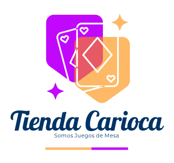

# FULLSTACK II SEMANA 7 CATALOGO JUEGOS DE MESA VERSIÓN ANGULAR

  

  Somos una tienda especializada en juegos de mesa. ¡Bienvenidos a nuestro repositorio!

## Descripción de la Actividad
En esta séptima semana realizarás la actividad formativa individual 5, llamada “Integrando APIs externas a nuestro FrontEnd” para practicar lo aprendido sobre la manipulación de archivos JSON. En esta actividad deberán mostrar a través de un encargo los elementos consumidos mediante el JSON disponible en AVA para que sean mostrados en el desarrollo realizado en la semana 6.

## Objetivos
Para el desarrollo de esta actividad considere el producto de la actividad formativa N°4, y aplique las actualizaciones tomando en cuenta lo siguiente:

1.	Se debe crear un proyecto nuevo en Angular y ejecutar las instrucciones. Recuerde que se continuará con el desarrollo de la actividad formativa de la semana 5. 
2.	Se deben agregar nuevos componentes para poder mostrar datos de un JSON.
3.	Se deben crear los archivos JSON que serán consumidos. 

## Nombre de la Tienda
- Tienda Carioca, somos juegos de mesa

## Categorías
- Estrategia
- Familiares
- Party Games
- Cooperativos

## Catálogo

### Estrategia

- Catan
- Risk
- Ticket to Ride
- Splendor

### Familiares

- Monopoly
- Scrabble
- Clue
- Uno

### Party Games

- Taboo
- Charades
- Exploding Kittens

### Cooperativos

- Pandemic
- Flash Point
- Forbidden Island

## Stack Utilizado
- HTML
- Javascript
- Css
- Logo Adobe
- Visual Studio Code
- Extenciones Live Preview Microsoft
- Bootstrap 5.3

## Git y Trello
- Los links relacionados se comparten en AVA

## Conclusiones
El ejercicio cumple satisfactoriamente con los objetivos planteados.